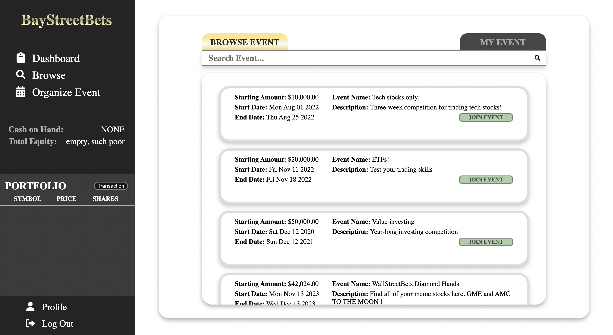
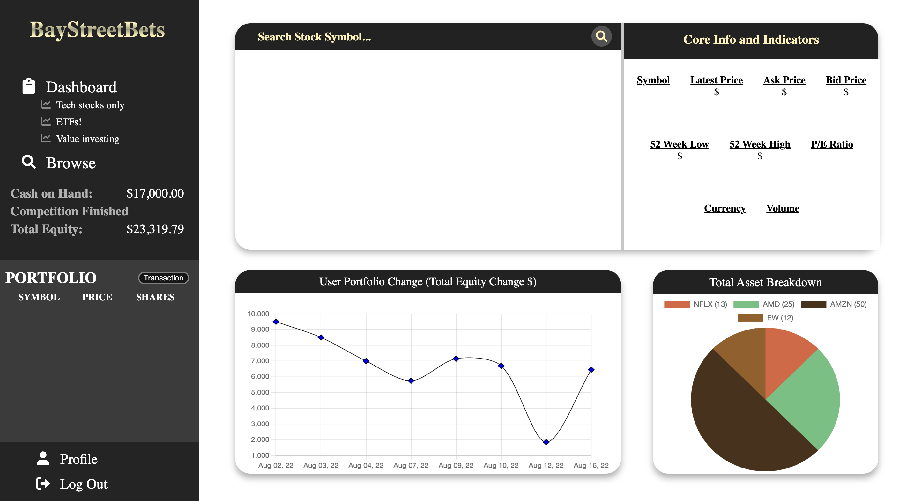
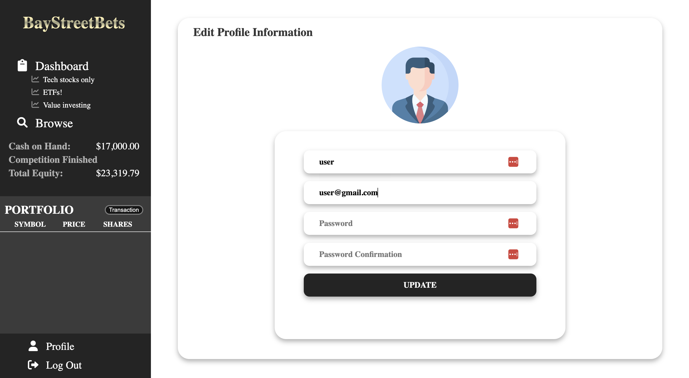

# BayStreetBets

## About the project

BayStreetBets is a full-stack web application where users can create and join stock-trading competitions and compete to earn the most profit.

BayStreetBets was built as a final project for Lighthouse Labs Web Development Program by:

- Ryan Punwasi
- Michael Le Duong
- Sidney Pang

## A quick glance

Browse Competitions

  

Dashboard

Profile

  

## Dependencies

- React (17.0.2)
- React Router (5.3.0)
- React-Redux (7.2.6)
